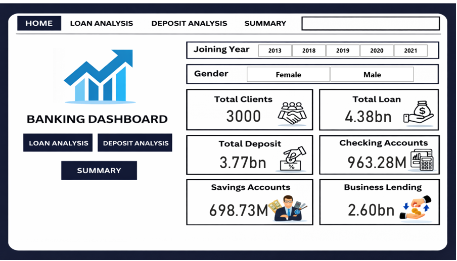
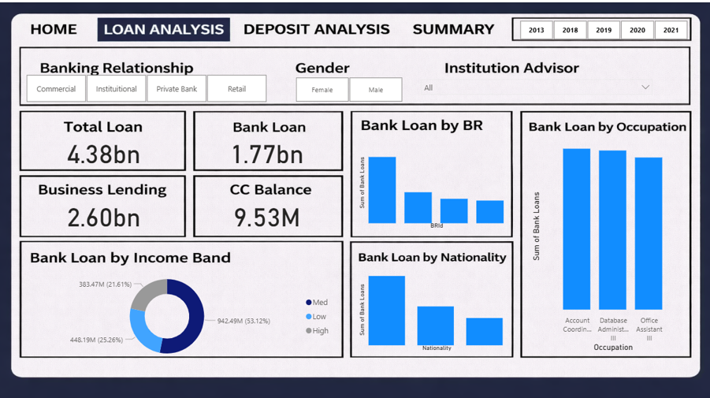
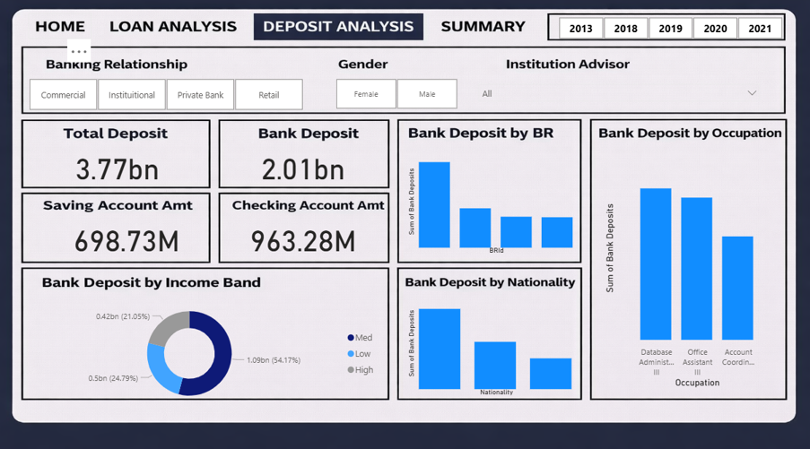
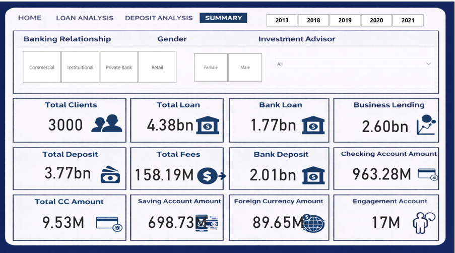

# Banking Risk Analytics Dashboard

## Project Overview
This project analyses banking data to understand loan risk, customer deposits, and financial exposure. 
An interactive Power BI dashboard was built to help banks make data-driven lending decisions.

## Business Problem
Banks face financial risk while lending to customers. 
The objective is to analyse customer financial data and minimise the risk of loan defaults.

## Tools Used
- Power BI
- DAX
- Python (EDA)
- Excel
- GitHub

## Dataset Description
The dataset contains:
- Client-Banking data
- Loan information
- Deposit details
- Credit card balances
- Customer engagement data

## Key KPIs
- Total Clients
- Total Loan
- Total Deposit
- Total Fees
- Bank Loan
- Business Lending
- Credit Card Balance
- Engagement Length

## Dashboard Pages
1. Home Overview
2. Loan Analysis
3. Deposit Analysis
4. Summary Dashboard

## Skills Demonstrated
- Data Cleaning
- KPI Development
- DAX Calculations
- Data Visualization
- Business Insight Analysis

## Dashboard Preview

### Home

## Loan Analysis

## Deposit Analysis

## Summary

